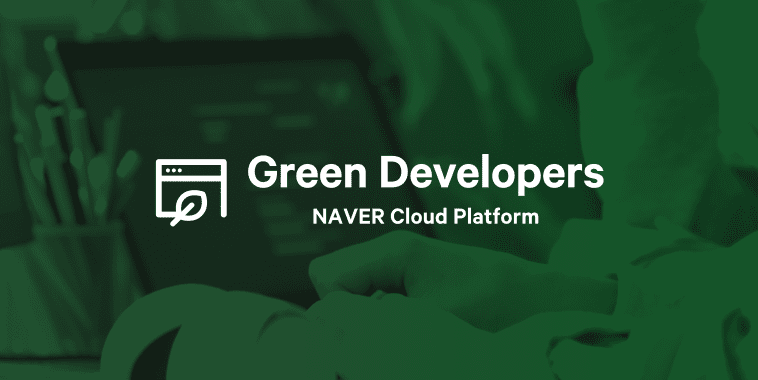

## B612
  
**Communauté de développeurs du les Petit Princes**  
어린왕자 개발 커뮤니티 B612

B612는 홍익대학교 내 개발 기술에 관심있는 학생들을 위한 사립 소모임입니다.

2022년 12월 창립되었으며, 홍익대학교 내 개발 문화 활성화 및 주니어 개발자들의 성장을 지원하는 목적을 갖고서 활동하고 있습니다.

B612에 대한 자세한 정보는 [About B612](https://hongik-b612.notion.site/About-B612-6fba9fb0ec6c4a58bb1ed58b7b7dd641?pvs=4) 페이지에서 확인할 수 있습니다.
## Naver Cloud 제휴

B612는 홍익대학교 내 유일한 Naver Cloud와의 제휴 관계에 있는 단체입니다. Naver Cloud의 예비 개발자 지원 프로그램 **Green Developers** 소속으로 참여하고 있습니다.

## Contact Us
- Email : limazero14@g.hongik.ac.kr
